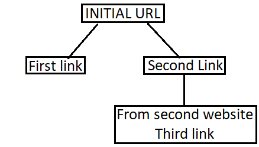

# ScrapeImagesPY

On run supply with initial website URL and depth of how much link it should enter. 

Creates folder with each website name and download the picture to them. 
In the end create JSON file with all the data of website url, picture url and in which depth picture was found.

